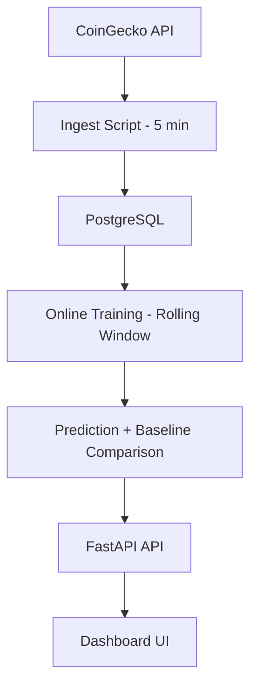

# Bitcoin Real-Time Prediction Pipeline

A production-style data pipeline that ingests Bitcoin price data every 5 minutes,
stores it in PostgreSQL, trains a rolling machine learning model,
evaluates predictions against a naive baseline in real time,
and exposes metrics through a FastAPI dashboard.

This project focuses on **correct ML evaluation in production systems** — not just prediction accuracy.

---

## Architecture


## Engineering Highlights

Scheduled price ingestion (5-minute interval)

PostgreSQL time-series storage

Rolling window model training

Prequential evaluation (predict → observe → score)

Baseline comparison ("next price = current price")

Rolling MAE tracking (50 / 200 windows)

Model state persistence (singleton control table)

Controlled retraining cadence (30-minute guard)

VPS deployment with Nginx reverse proxy

## Why This Project Is Interesting

Instead of measuring offline model accuracy, this system:

Makes a prediction

Waits for the next real price

Scores the prediction

Compares it against a naive baseline

Tracks rolling performance over time

This simulates how real-world ML monitoring systems operate in production.

The focus is on evaluation correctness and system design, not prediction complexity.

## Tech Stack

Python 3.10

FastAPI

SQLAlchemy

PostgreSQL

scikit-learn (LinearRegression)

Nginx (reverse proxy)

VPS deployment

##⚙️ Quick Start (Local Development)

1. Clone Repository
```bash
git clone https://github.com/cbrentas/btcpipeline.git
cd btcpipeline
```

3. Create Virtual Environment
```bash
python -m venv venv
source venv/bin/activate
pip install -r requirements.txt
```
4. Create .env File

Create a file named .env in the root directory and add:
```bash
DB_USER=postgres
DB_PASSWORD=postgres
DB_HOST=localhost
DB_PORT=5432
DB_NAME=btcpipeline
API_KEY=your_api_key
```
4. Run API Server
```bash
uvicorn app.main:app --reload
```
Visit:
```bash
http://localhost:8000/dashboard
```
## Running Ingestion
```bash
python scripts/ingest.py
```
In production this runs every 5 minutes via cron or systemd.

## Running Training Pipeline
```bash
python scripts/train_online.py
```
This will:

Score pending predictions

Train rolling window model (if needed)

Create a new next-step prediction

## Model Evaluation

The system tracks:

Rolling MAE (50 window)

Rolling MAE (200 window)

Baseline MAE comparison

Trend detection (improving / worsening)

Whether the model beats the naive baseline

API endpoint:

GET /model/summary

Historical prediction tracking:

GET /model/history
## Design Decisions
Why Linear Regression?

The objective is not to maximize predictive accuracy.

The objective is to demonstrate:

Proper online evaluation flow

Baseline comparison

Model lifecycle management

Stateful training coordination

The architecture allows replacing the model with ARIMA, XGBoost, LSTM, or any other algorithm without modifying the evaluation framework.

## Security

API key protection

Environment-based configuration

Reverse proxy deployment via Nginx

## Future Improvements

Structured logging

Retry logic for external API failures

Unit and integration tests

Docker containerization

Prometheus metrics

Feature engineering (returns instead of raw price)

Model version comparison framework


---
