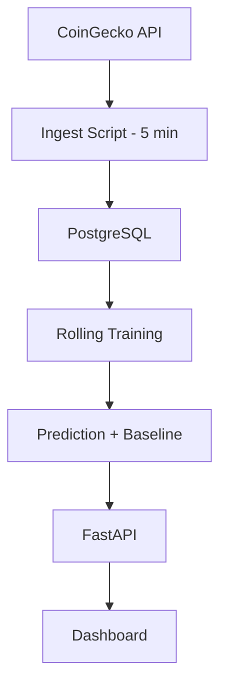
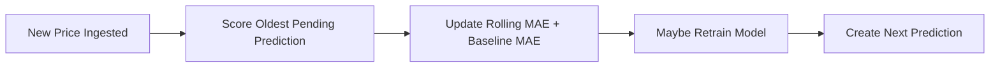

# Bitcoin Real-Time Prediction Pipeline

A lightweight production-style pipeline that:

- Fetches Bitcoin prices every 5 minutes
- Stores data in PostgreSQL
- Trains a rolling ML model
- Scores predictions against a naive baseline
- Serves metrics through a FastAPI dashboard

The focus is **correct ML evaluation in a production-style system**, not prediction hype.

---

## Live Demo

Dashboard: https://header.cr7sp3r.com/dashboard

---

## Architecture



---

## Prediction Lifecycle



Each prediction is created **before observing the true value**.  
When the next price arrives, the system scores the previous prediction and compares it to a naive baseline ("next price = current price").

This mirrors how production ML systems monitor real-world performance.

---

## What Makes This Different?

Instead of training offline and reporting static accuracy:

1. The system makes a prediction
2. Waits for the next real price
3. Scores the prediction
4. Compares it against a baseline
5. Tracks rolling MAE over time

The emphasis is on evaluation correctness and lifecycle design, not model complexity.

---

## Engineering Highlights

- Scheduled price ingestion (5-minute interval)
- PostgreSQL time-series storage
- Rolling window model training
- Prequential evaluation (predict → observe → score)
- Baseline comparison ("next price = current price")
- Rolling MAE tracking (50 / 200 windows)
- Model state persistence (singleton control table)
- Controlled retraining cadence (30-minute guard)
- VPS deployment with Nginx reverse proxy

---

## Deployment (VPS)

This project is deployed on a VPS and exposed via a custom domain behind an Nginx reverse proxy.

- Nginx handles public HTTP traffic
- Requests are proxied to Uvicorn/FastAPI
- The FastAPI service runs continuously via systemd
- Ingestion runs every 5 minutes (cron/systemd timer)
- Training runs on a fixed cadence and persists model artifacts to disk

This setup mirrors a minimal real-world production environment:
public entrypoint → reverse proxy → application server → database.

---

## Tech Stack

- Python 3.10
- FastAPI
- SQLAlchemy
- PostgreSQL
- scikit-learn (LinearRegression)
- Nginx (reverse proxy)
- VPS deployment

---

## Quick Start (Local Development)

### 1) Clone Repository

```bash
git clone https://github.com/cbrentas/btcpipeline.git
cd btcpipeline
```

### 2) Create Virtual Environment

```bash
python -m venv venv
source venv/bin/activate
pip install -r requirements.txt
```

### 3) Create `.env` File

Create a file named `.env` in the root directory and add:

```bash
DB_USER=postgres
DB_PASSWORD=postgres
DB_HOST=localhost
DB_PORT=5432
DB_NAME=btcpipeline
API_KEY=your_api_key
```

### 4) Run API Server

```bash
uvicorn app.main:app --reload
```

Visit:

```
http://localhost:8000/dashboard
```

---

## Run With Docker

If you have Docker installed:

```bash
docker compose up --build
```

Then open:

```
http://localhost:8000/dashboard
```

The compose file spins up:

- PostgreSQL
- FastAPI application

When running with Docker, ensure your `.env` contains:

```
DB_HOST=db
```

---

## Running the Pipeline Manually

### Ingestion

```bash
python scripts/ingest.py
```

In production this runs every 5 minutes via cron or systemd.

### Training & Scoring

```bash
python scripts/train_online.py
```

This will:

- Score pending predictions
- Train rolling window model (if needed)
- Create a new next-step prediction

---

## Model Evaluation

The system tracks:

- Rolling MAE (50 window)
- Rolling MAE (200 window)
- Baseline MAE comparison
- Trend detection (improving / worsening)
- Whether the model beats the naive baseline

API endpoints:

```
GET /metrics
GET /model/summary
GET /model/history
```

Swagger documentation available at:

```
/docs
```

---

## Design Decisions

### Why Linear Regression?

The objective is not to maximize predictive accuracy.

The objective is to demonstrate:

- Proper online evaluation flow
- Baseline comparison
- Model lifecycle management
- Stateful training coordination

The architecture allows replacing the model with ARIMA, XGBoost, LSTM, or any other algorithm without modifying the evaluation framework.

---

## Security

- API key protection
- Environment-based configuration
- Reverse proxy deployment via Nginx

---

## Future Improvements

- Structured logging
- Retry logic for external API failures
- Unit and integration tests
- Prometheus metrics
- Feature engineering (returns instead of raw price)
- Model version comparison framework
